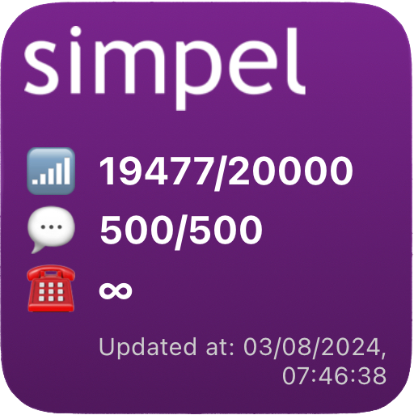

This repository contains widget scripts that can be used with the Scriptable app.
More widgets will be added if I have created one of which I think others might find it useful.

## Mijn Simpel
This widget shows the remaining data/sms/voice credits for the Dutch provider `Simpel`

After "installing" you are asked to enter your credentials, it will then store these and tokens in separate files in the Scriptable documents folder.

It will then update the credits every 30 minutes.

